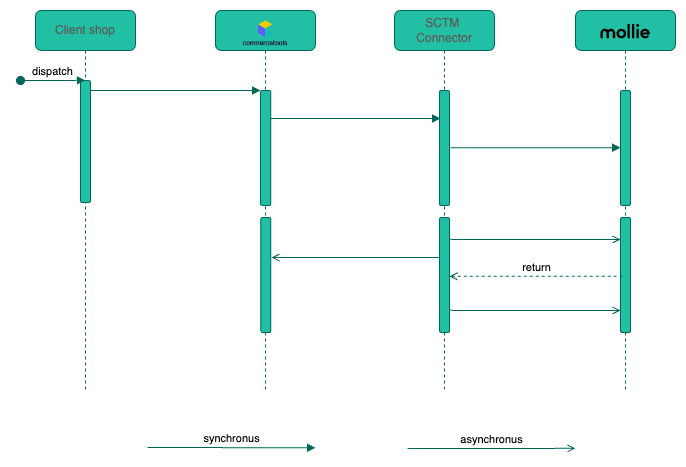

# 🚀 COMMERCETOOLS MOLLIE CONNECTOR 🚀

This project provides a commercetools connector integrating between the conmmercetools and Mollie PSP

- [About Mollie](#about)
- [Supported features](#supported-features)

---

## 🌟 About Mollie

At Mollie, we’re on a mission to make payments and money management effortless for every business in Europe.

We started 20 years ago when we launched a more direct, affordable way for companies to get paid. That provided an alternative to the frustrating, overpriced solutions that banks offered at the time.

## 📔 Supported features

- [Mollie hosted checkout](https://docs.mollie.com/payments/hosted-checkout) based payment methods.
  - Note: since the integration relies on the usage of Mollie checkout environment it does not need to process sensitive credit card data and thus is fully PCI DSS **compliant**.
- Asynchronous notifications handling via [processor module](#processor-module).
- Making payments
- Cancelations
- Refunds

## Prerequisite

1. Commercetools composable commerce account
2. [Mollie account](https://www.mollie.com/dashboard/)

## 📐 Architecture Principles

This repository contains two standalone modules that interact with commercetools and Mollie.
Complete integration requires running both of the modules.

## Processor module

The processor responsible for two disimilar tasks:

- ## Extensions

  This service will be triggered on every Payment create or update request.
  Based on the body of that request, it will make call(s) to mollie's API.

  - Follow this instruction for how to configure this service.

- ## Notifications

  This service will receive asynchronous notifications sent by Mollie.
  Through notifications, Mollie provides asynchronous payment status changes like authorized, captured, or refunded then match and update the commercetools payment status accordingly.

  - Follow this instruction for how to configure this service.

## 🤝 Contributing

Contributions are what make the open-source community such an amazing place to learn, inspire, and create. Any contributions you make are greatly appreciated.

## 📝 License

Distributed under the MIT License. See LICENSE for more information.

## 📞 Contact

[Mollie's support page](https://help.mollie.com/hc/en-us)

[Get in touch with us](https://www.mollie.com/de/contact/merchants)

 <b>Happy Coding! 🚀</b> 

